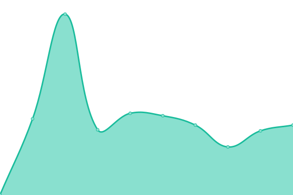

# [📈 Live Status](https://status.phpmyfaq.de): <!--live status--> **🟥 Complete outage**

This repository contains the open-source uptime monitor and status page for [phpMyFAQ](https://www.phpmyfaq.de), powered by [Upptime](https://github.com/upptime/upptime).

With [Upptime](https://upptime.js.org), you can get your own unlimited and free uptime monitor and status page, powered entirely by a GitHub repository. We use [Issues](https://github.com/phpMyFAQ/status.phpmyfaq.de/issues) as incident reports, [Actions](https://github.com/phpMyFAQ/status.phpmyfaq.de/actions) as uptime monitors, and [Pages](https://status.phpmyfaq.de) for the status page.

<!--start: status pages-->
<!-- This summary is generated by Upptime (https://github.com/upptime/upptime) -->
<!-- Do not edit this manually, your changes will be overwritten -->
<!-- prettier-ignore -->
| URL | Status | History | Response Time | Uptime |
| --- | ------ | ------- | ------------- | ------ |
|  [phpMyFAQ Homepage](https://www.phpmyfaq.de) | 🟥 Down | [php-my-faq-homepage.yml](https://github.com/phpMyFAQ/status.phpmyfaq.de/commits/HEAD/history/php-my-faq-homepage.yml) | 

 857ms
     
 | 

<a href="https://status.phpmyfaq.de/history/php-my-faq-homepage">97.61%</a>
    

|  [phpMyFAQ API](https://api.phpmyfaq.de/versions) | 🟥 Down | [php-my-faq-api.yml](https://github.com/phpMyFAQ/status.phpmyfaq.de/commits/HEAD/history/php-my-faq-api.yml) | 

 722ms
     
 | 

<a href="https://status.phpmyfaq.de/history/php-my-faq-api">97.71%</a>
    

|  [phpMyFAQ Demo](https://demo.phpmyfaq.de) | 🟥 Down | [php-my-faq-demo.yml](https://github.com/phpMyFAQ/status.phpmyfaq.de/commits/HEAD/history/php-my-faq-demo.yml) | 

 810ms
     
 | 

<a href="https://status.phpmyfaq.de/history/php-my-faq-demo">97.80%</a>
    

|  [phpMyFAQ Password Hash Generator Tool](https://password.phpmyfaq.de) | 🟥 Down | [php-my-faq-password-hash-generator-tool.yml](https://github.com/phpMyFAQ/status.phpmyfaq.de/commits/HEAD/history/php-my-faq-password-hash-generator-tool.yml) | 

 697ms
     
 | 

<a href="https://status.phpmyfaq.de/history/php-my-faq-password-hash-generator-tool">97.89%</a>
    

<!--end: status pages-->

[**Visit our status website →**](https://status.phpmyfaq.de)

## 📄 License

- Powered by: [Upptime](https://github.com/upptime/upptime)
- Code: [MIT](./LICENSE) © [phpMyFAQ](https://www.phpmyfaq.de)
- Data in the `./history` directory: [Open Database License](https://opendatacommons.org/licenses/odbl/1-0/)
