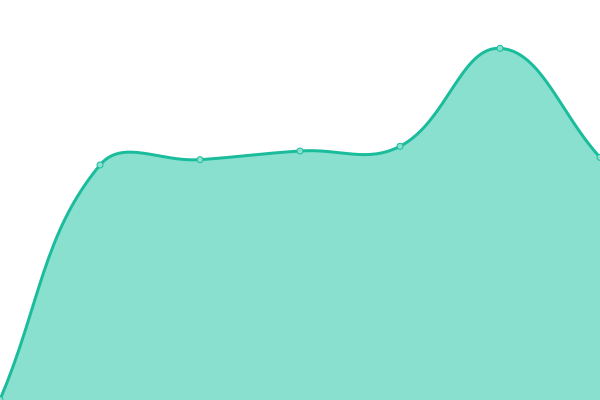

# [📈 Live Status](https://status.phpmyfaq.de): <!--live status--> **🟩 All systems operational**

This repository contains the open-source uptime monitor and status page for [phpMyFAQ](https://www.phpmyfaq.de), powered by [Upptime](https://github.com/upptime/upptime).

With [Upptime](https://upptime.js.org), you can get your own unlimited and free uptime monitor and status page, powered entirely by a GitHub repository. We use [Issues](https://github.com/phpMyFAQ/status.phpmyfaq.de/issues) as incident reports, [Actions](https://github.com/phpMyFAQ/status.phpmyfaq.de/actions) as uptime monitors, and [Pages](https://status.phpmyfaq.de) for the status page.

<!--start: status pages-->
<!-- This summary is generated by Upptime (https://github.com/upptime/upptime) -->
<!-- Do not edit this manually, your changes will be overwritten -->

| URL                                                                   | Status | History                                                                                                                                                          | Response Time                                                                                                | Uptime                                                                                                                                                                                                                                                                              |
| --------------------------------------------------------------------- | ------ | ---------------------------------------------------------------------------------------------------------------------------------------------------------------- | ------------------------------------------------------------------------------------------------------------ | ----------------------------------------------------------------------------------------------------------------------------------------------------------------------------------------------------------------------------------------------------------------------------------- |
| [phpMyFAQ Homepage](https://www.phpmyfaq.de)                          | 🟩 Up  | [php-my-faq-homepage.yml](https://github.com/phpMyFAQ/status.phpmyfaq.de/commits/master/history/php-my-faq-homepage.yml)                                         |  606ms                     |                                          |
| [phpMyFAQ API](https://api.phpmyfaq.de/versions)                      | 🟩 Up  | [php-my-faq-api.yml](https://github.com/phpMyFAQ/status.phpmyfaq.de/commits/master/history/php-my-faq-api.yml)                                                   |  560ms                          |                                                    |
| [phpMyFAQ Demo](https://demo.phpmyfaq.de)                             | 🟩 Up  | [php-my-faq-demo.yml](https://github.com/phpMyFAQ/status.phpmyfaq.de/commits/master/history/php-my-faq-demo.yml)                                                 |  714ms                         |                                                  |
| [phpMyFAQ Password Hash Generator Tool](https://password.phpmyfaq.de) | 🟩 Up  | [php-my-faq-password-hash-generator-tool.yml](https://github.com/phpMyFAQ/status.phpmyfaq.de/commits/master/history/php-my-faq-password-hash-generator-tool.yml) |  705ms |  |

<!--end: status pages-->

[**Visit our status website →**](https://status.phpmyfaq.de)

## 📄 License

- Powered by: [Upptime](https://github.com/upptime/upptime)
- Code: [MIT](./LICENSE) © [phpMyFAQ](https://www.phpmyfaq.de)
- Data in the `./history` directory: [Open Database License](https://opendatacommons.org/licenses/odbl/1-0/)
